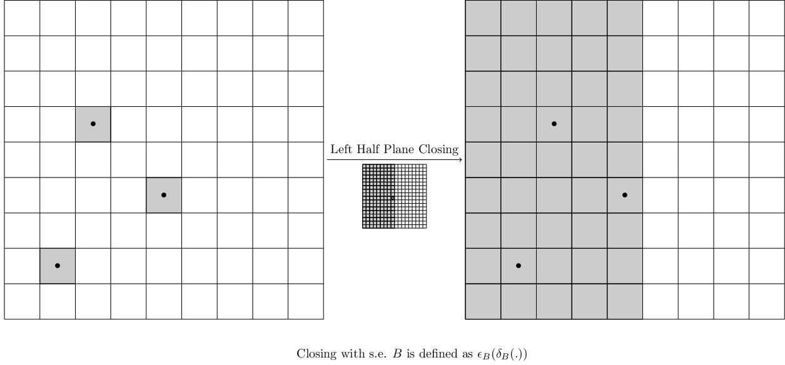

## IPARC Challenge 2022

### List of Primitives

|  Name  | Primitive  |
|---|---|
| <tt> Change_Color </tt> | [](./img_primitives/ChangeColor.png)  |
| <tt> Change_Color_2 </tt> | [](./img_primitives/ChangeColor2.png) |
| <tt> Crop </tt> | [](./img_primitives/Crop.png) |
| <tt> Dilation_1 </tt> | [](./img_primitives/Dilation_Task11_1.png) |
| <tt> Dilation_2 </tt> | [](./img_primitives/Dilation_Task11_2.png)  |
| <tt> HMT_R1 </tt> | [](./img_primitives/HMT_Reflecttion1.png) |
| <tt> HMT_R2 </tt> | [](./img_primitives/HMT_Reflecttion2.png) |
| <tt> HMT_R3 </tt> | [](./img_primitives/HMT_Reflecttion3.png) |
| <tt> HMT_R4 </tt> | [](./img_primitives/HMT_Reflecttion4.png)  |
| <tt> HMT_SE1 </tt> | [](./img_primitives/HMT_Task11_1.png) |
| <tt> HMT_SE2 </tt> | [](./img_primitives/HMT_Task11_2.png) |
| <tt> Increase_Size </tt> | [](./img_primitives/IncreaseSize.png) |
| <tt> Shift_Above </tt> | [](./img_primitives/ShiftAbove.png)  |
| <tt> Shift_Below </tt> | [](./img_primitives/ShiftBelow.png) |
| <tt> Shift_Right </tt> | [](./img_primitives/ShiftRight.png) |
| <tt> Shift_Left </tt> | [](./img_primitives/ShiftLeft.png) |
| <tt> Top_Half_Plane_Closing </tt> | [](./img_primitives/TopHalfPlaneClosing.png)  |
| <tt> Bottom_Half_Plane_Closing </tt> | [](./img_primitives/BottomHalfPlaneClosing.png) |
| <tt> Right_Half_Plane_Closing </tt> | [](./img_primitives/RightHalfPlaneClosing.png) |
| <tt> Left_Half_Plane_Closing </tt> | [](./img_primitives/LeftHalfPlaneClosing.png) |

### Category A Tasks

#### Task 1 - Convex Closing

|    |   |
|---|---|
|Example A| [](./img_CatA/ConvexClosing_Ex1.png) |
|Example B| [](./img_CatA/ConvexClosing_Ex2.png) |
|Example C| [](./img_CatA/ConvexClosing_Ex3.png) |

**Target Program**

[](./img_CatA/ConvexClosing.png)

#### Task 2 - Shift Down

|    |   |
|---|---|
|Example A| [](./img_CatA/Task2_ARC_Ex1.png) |
|Example B| [](./img_CatA/Task2_ARC_Ex2.png) |
|Example C| [](./img_CatA/Task2_ARC_Ex3.png) |

**Target Program**

[](./img_CatA/Task2_ARC.png)

#### Task 3 - Intersection

|    |   |
|---|---|
|Example A| [](./img_CatA/Task5_ARC_Ex1.png) |
|Example B| [](./img_CatA/Task5_ARC_Ex2.png) |
|Example C| [](./img_CatA/Task5_ARC_Ex3.png) |

**Target Program**

[](./img_CatA/Task5_ARC.png)

#### Task 4 - Conditional Dilation

|    |   |
|---|---|
|Example A| [](./img_CatA/Task11_ARC_Ex1.png) |
|Example B| [](./img_CatA/Task11_ARC_Ex2.png) |
|Example C| [](./img_CatA/Task11_ARC_Ex3.png) |

**Target Program**

[](./img_CatA/Task11_ARC_Ex1.png)

<!-- 
You can use the [editor on GitHub](https://github.com/ac20/IPARC_Challenge/edit/gh-pages/index.md) to maintain and preview the content for your website in Markdown files.

Whenever you commit to this repository, GitHub Pages will run [Jekyll](https://jekyllrb.com/) to rebuild the pages in your site, from the content in your Markdown files.

### Markdown

Markdown is a lightweight and easy-to-use syntax for styling your writing. It includes conventions for

```markdown
Syntax highlighted code block

# Header 1
## Header 2
### Header 3

- Bulleted
- List

1. Numbered
2. List

**Bold** and _Italic_ and `Code` text

[Link](url) and 
```

For more details see [Basic writing and formatting syntax](https://docs.github.com/en/github/writing-on-github/getting-started-with-writing-and-formatting-on-github/basic-writing-and-formatting-syntax).

### Jekyll Themes

Your Pages site will use the layout and styles from the Jekyll theme you have selected in your [repository settings](https://github.com/ac20/IPARC_Challenge/settings/pages). The name of this theme is saved in the Jekyll `_config.yml` configuration file.

### Support or Contact

Having trouble with Pages? Check out our [documentation](https://docs.github.com/categories/github-pages-basics/) or [contact support](https://support.github.com/contact) and we’ll help you sort it out.
 -->
